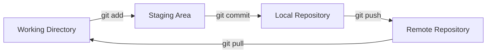
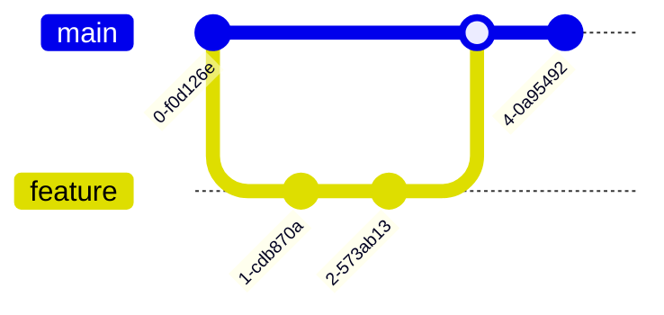
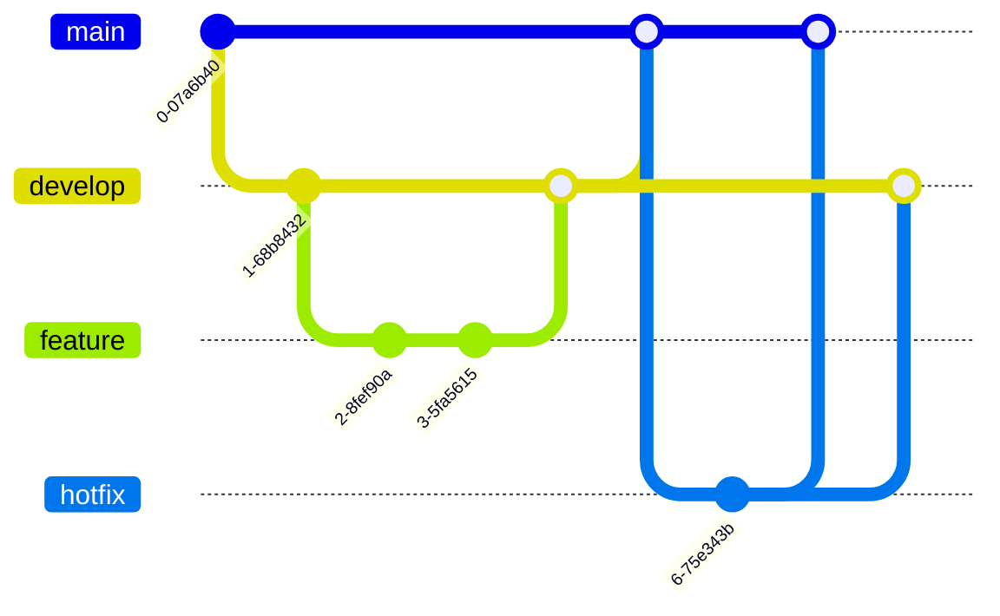

# Git Command Guide

A comprehensive guide to Git commands, workflows, and best practices.

## Table of Contents
- [Quick Reference](#quick-reference)
- [Visual Workflows](#visual-workflows)
- [Basic Commands](#basic-commands)
- [Branch Management](#branch-management)
- [Remote Operations](#remote-operations)
- [Advanced Operations](#advanced-operations)
- [Best Practices](#best-practices)
- [Project-Specific Examples](#project-specific-examples)

## Quick Reference

### Most Used Commands
```
git status              # Check current status
git add .               # Stage all changes
git commit -m "msg"     # Commit with message
git pull               # Get latest changes
git push               # Push your changes
git checkout -b name   # Create new branch
```

### Common Workflows

#### Starting New Feature
1. `git checkout main`
2. `git pull`
3. `git checkout -b feature/name`

#### Updating Your Branch
1. `git fetch origin`
2. `git rebase origin/main`

#### Finishing Feature
1. `git add .`
2. `git commit -m "feat: description"`
3. `git push origin feature/name`

## Visual Workflows

### Basic Git Workflow


### Feature Branch Workflow


### Git Flow Model


## Basic Commands

### Repository Setup
```bash
# Initialize a new Git repository
git init

# Clone an existing repository
git clone <repository-url>
# Example:
git clone https://github.com/username/repo.git
```

### Working with Changes

#### Checking Status
```bash
# Show working tree status
git status

# Show status in short format
git status -s
```

#### Staging Changes
```bash
# Add specific file to staging
git add <file-name>

# Add all modified and new files
git add .

# Add all tracked files (excluding new files)
git add -u

# Interactive staging (choose chunks to stage)
git add -p
```

#### Committing Changes
```bash
# Commit staged changes with message
git commit -m "Your commit message"

# Add and commit tracked files in one command
git commit -am "Your commit message"

# Amend the last commit
git commit --amend
git commit --amend --no-edit  # Keep the same message
```

#### Viewing Changes
```bash
# Show unstaged changes
git diff

# Show staged changes
git diff --staged

# Show changes in a specific file
git diff <file-name>

# Show commits history
git log
git log --oneline  # Compact view
git log --graph    # With branch graph
git log --patch    # With changes
```

## Branch Management

### Basic Branch Operations
```bash
# List all branches
git branch
git branch -a  # List all branches (including remote)
git branch -v  # List branches with last commit

# Create new branch
git branch <branch-name>

# Switch to a branch
git checkout <branch-name>

# Create and switch to new branch
git checkout -b <branch-name>

# Delete branch (after merging)
git branch -d <branch-name>

# Force delete branch (unmerged changes will be lost)
git branch -D <branch-name>
```

### Merging
```bash
# Merge a branch into current branch
git merge <branch-name>

# Merge with no fast-forward
git merge --no-ff <branch-name>

# Abort a merge in case of conflicts
git merge --abort
```

### Rebasing
```bash
# Rebase current branch onto another
git rebase <branch-name>

# Interactive rebase for last n commits
git rebase -i HEAD~<n>

# Abort rebase
git rebase --abort

# Continue rebase after resolving conflicts
git rebase --continue
```

## Remote Operations

### Managing Remotes
```bash
# List remote repositories
git remote -v

# Add remote repository
git remote add <name> <url>

# Remove remote
git remote remove <name>

# Change remote URL
git remote set-url <name> <new-url>
```

### Syncing with Remote
```bash
# Fetch changes from remote
git fetch <remote>
git fetch --all  # Fetch from all remotes

# Pull changes from remote (fetch + merge)
git pull <remote> <branch>
git pull --rebase  # Pull with rebase instead of merge

# Push changes to remote
git push <remote> <branch>
git push -u origin <branch>  # Set upstream and push
git push --force            # Force push (use with caution!)
git push --force-with-lease # Safer force push
```

## Advanced Operations

### Stashing
```bash
# Save working directory changes
git stash

# List stashes
git stash list

# Apply most recent stash
git stash apply
git stash pop  # Apply and remove stash

# Apply specific stash
git stash apply stash@{n}

# Create branch from stash
git stash branch <branch-name>

# Drop stash
git stash drop stash@{n}
git stash clear  # Remove all stashes
```

### Reset & Cleanup
```bash
# Reset staged changes
git reset

# Reset to specific commit
git reset --soft HEAD~1   # Keep changes staged
git reset --mixed HEAD~1  # Unstage changes
git reset --hard HEAD~1   # Discard changes (dangerous!)

# Clean untracked files
git clean -n  # Dry run
git clean -f  # Force clean
git clean -fd # Clean directories too
```

### Tags
```bash
# Create lightweight tag
git tag <tag-name>

# Create annotated tag
git tag -a <tag-name> -m "Tag message"

# List tags
git tag -l
git tag -n  # Show tag messages

# Delete tag
git tag -d <tag-name>

# Push tags to remote
git push origin <tag-name>
git push origin --tags  # Push all tags
```

## Best Practices

### Commit Messages
- Use imperative mood ("Add feature" not "Added feature")
- First line: Short summary (50 chars or less)
- Leave blank line after summary
- Detailed explanation if needed
- Reference issues and PRs

Example:
```bash
git commit -m "Add user authentication feature

- Implement JWT token-based auth
- Add login/logout endpoints
- Include password hashing
- Add unit tests

Fixes #123"
```

### Branch Naming
- Use descriptive prefixes:
  - feature/ - New features
  - bugfix/ - Bug fixes
  - hotfix/ - Urgent fixes
  - release/ - Release branches
  - docs/ - Documentation updates
- Use hyphens for spaces
- Include issue number if applicable

Examples:
```
feature/user-authentication
bugfix/login-validation-123
hotfix/security-patch
```

### Git Flow
1. Main Branches
   - `main` - Production-ready code
   - `develop` - Development integration

2. Supporting Branches
   - Feature branches from `develop`
   - Hotfix branches from `main`
   - Release branches from `develop`

3. Workflow
   ```bash
   # Start new feature
   git checkout develop
   git checkout -b feature/new-feature
   
   # Complete feature
   git checkout develop
   git merge --no-ff feature/new-feature
   git branch -d feature/new-feature
   
   # Create release
   git checkout -b release/1.0.0
   # Make release fixes
   git checkout main
   git merge --no-ff release/1.0.0
   git tag -a v1.0.0 -m "Version 1.0.0"
   ```

### Safety Tips
1. Always pull before pushing
2. Use `--force-with-lease` instead of `--force`
3. Create branches for new features
4. Regularly backup your repository
5. Review changes before committing
6. Keep commits atomic and focused

### Common Workflow Commands
```bash
# Start new work
git checkout main
git pull
git checkout -b feature/new-work

# Regular save points
git add .
git commit -m "Descriptive message"

# Prepare for PR
git fetch origin
git rebase origin/main
git push origin feature/new-work

# Clean up after merge
git checkout main
git pull
git branch -d feature/new-work
```

## Troubleshooting

### Fix Last Commit
```bash
# Change commit message
git commit --amend -m "New message"

# Add forgotten files
git add forgotten-file
git commit --amend --no-edit
```

### Undo Changes
```bash
# Discard changes in working directory
git restore <file>
git checkout -- <file>  # Old syntax

# Unstage files
git restore --staged <file>
git reset HEAD <file>   # Old syntax

# Revert a commit
git revert <commit-hash>
```

### Find Problems
```bash
# Show commit history for file
git log --follow -p <file>

# Show who changed what
git blame <file>

# Find lost commits
git reflog
```

### Maintenance
```bash
# Check repository
git fsck

# Compress repository
git gc

# Remove untracked files/directories
git clean -fd
```

## Project-Specific Examples

### ResearchGate Project Structure
This project follows a structured approach with backend, frontend, and documentation components. Here are common Git operations you'll use in this project:

### Backend Development
```bash
# Start new backend feature
git checkout -b feature/backend-auth
cd backend/apps/accounts
# Make changes to models.py
git add backend/apps/accounts/models.py
git commit -m "feat(auth): add user authentication models"

# Update API endpoints
cd ../core/api
git add viewsets.py serializers.py
git commit -m "feat(api): implement auth endpoints"
```

### Frontend Development
```bash
# Start new frontend feature
git checkout -b feature/frontend-research-page
cd frontend/src/pages
# Create new component
git add research/
git commit -m "feat(ui): add research page components"
```

### Documentation Updates
```bash
# Update documentation
git checkout -b docs/update-api-docs
cd docs/
git add api/
git commit -m "docs: update API documentation with auth endpoints"
```

### Common Project Workflows

#### Adding New Feature
1. Create feature branch from main
   ```bash
   git checkout main
   git pull
   git checkout -b feature/new-feature
   ```

2. Implement changes in appropriate directory
   ```bash
   # For backend changes
   cd backend/apps/relevant-app/
   # For frontend changes
   cd frontend/src/components/
   ```

3. Commit changes with proper prefix
   ```bash
   git commit -m "feat(component): description"
   ```

#### Updating Documentation
1. Create documentation branch
   ```bash
   git checkout -b docs/update-section
   ```

2. Update relevant documentation
   ```bash
   cd docs/
   # Edit markdown files
   git add .
   git commit -m "docs: update section with new information"
   ```

#### Bug Fixes
1. Create bugfix branch
   ```bash
   git checkout -b bugfix/issue-description
   ```

2. Fix and test
   ```bash
   # Make changes in relevant directory
   git add .
   git commit -m "fix: description (fixes #issue-number)"
   ```